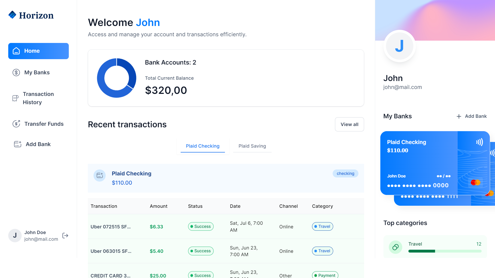

<div align="center">
    <a href="https://horizon-bank-fv.vercel.app" target="_blank">
      
    </a>
  <h3 align="center">Banking Platform</h3>
</div>

##  <br /> 📋 <a name="table">Table of Contents</a>

- ✨ [Introduction](#introduction)
- ⚙️ [Tech Stack](#tech-stack)
- 📝 [Features](#features)
- 🚀 [Quick Start](#quick-start)

##  <br /> <a name="introduction">✨ Introduction</a>

**[EN]** Built with Next.js, Horizon is a financial SaaS platform that connects to multiple bank accounts, displays transactions in real-time, allows users to transfer money to other platform users, and manages their finances altogether.

**[FR]** Construit avec Next.js, Horizon est une plateforme SaaS financière qui se connecte à plusieurs comptes bancaires, affiche les transactions en temps réel, permet aux utilisateurs de transférer de l'argent à d'autres utilisateurs de la plateforme et gère leurs finances de manière globale.

##  <br /> <a name="tech-stack">⚙️ Tech Stack</a>

Here's the organized list with more details for each technology, including React:

- **Next.js** is a React framework for building high-performance web applications with server-side rendering (SSR) and static site generation (SSG). It optimizes SEO and provides features like automatic code splitting, API routes, and an extensive plugin ecosystem.

- **React** is a JavaScript library for building user interfaces. React allows developers to create reusable UI components and manage the state efficiently. It is known for its virtual DOM and component-based architecture, which enhances performance and maintainability.

- **TypeScript** is a statically typed superset of JavaScript that adds type definitions to enhance code maintainability and robustness. It helps developers catch errors early in the development process and provides better tooling and refactoring capabilities.

- **Appwrite** is an open-source backend server that provides essential services like authentication, real-time databases, file storage, cloud functions, and more. It's designed to streamline web and mobile app development by offering a unified API for backend functionalities.

- **Plaid** is a financial services API that allows applications to connect with users' bank accounts, retrieve transaction data, verify account balances, and access other banking information. It supports integrations with major banks and financial institutions, enhancing fintech applications.

- **Dwolla** is a payments platform that enables businesses to integrate ACH (Automated Clearing House) payments for transferring money between bank accounts. It offers features like real-time payments, low transaction fees, and robust security measures, making it suitable for various payment solutions.

- **React Hook Form** is a library for managing form state and validation in React applications. It leverages React hooks to provide a minimal API, improving form performance and reducing the amount of code needed for complex form handling and validation.

- **Zod** is a TypeScript-first schema declaration and validation library that ensures data integrity and validation through its strong typing and inference capabilities. Zod allows developers to define schemas for their data models, providing runtime validation and type safety.

- **Tailwind** is a utility-first CSS framework for rapidly building custom user interfaces. It offers a comprehensive set of utility classes that can be composed to create complex designs without writing custom CSS. TailwindCSS promotes consistency and reusability in styling.

- **Chart.js** is a flexible JavaScript charting library for creating interactive and visually appealing charts and graphs. It supports various chart types, such as line, bar, pie, and radar charts, and offers extensive customization options to tailor the visual representation to specific needs.

- **ShadCN** is a UI component library that provides a set of highly customizable components designed to work seamlessly with React and TailwindCSS. ShadCN focuses on delivering accessible, reusable, and themeable components to accelerate UI development and maintain design consistency.

## <br/> <a name="features">📝 Features</a>

👉 **Robust Authentication**: Secure and reliable user login and registration system.

👉 **Modern Home Page**: Showcases trending podcasts with a sticky podcast player for continuous listening.

👉 **Discover Podcasts Page**: Dedicated page for users to explore new and popular podcasts.

👉 **Fully Functional Search**: Allows users to find podcasts easily using various search criteria.

👉 **Create Podcast Page**: Enables podcast creation with text-to-audio conversion, AI image generation, and previews.

👉 **Multi Voice AI Functionality**: Supports multiple AI-generated voices for dynamic podcast creation.

👉 **Profile Page**: View all created podcasts with options to delete them.

👉 **Podcast Details Page**: Displays detailed information about each podcast, including creator details, number of listeners, and transcript.

👉 **Podcast Player**: Features backward/forward controls, as well as mute/unmute functionality for a seamless listening experience.

👉 **Responsive Design**: Fully functional and visually appealing across all devices and screen sizes.

## <br /> <a name="quick-start">🚀 Quick Start</a>

Follow these steps to set up the project locally on your machine.

<br/>**Prerequisites**

Make sure you have the following installed on your machine:

- [Git](https://git-scm.com/)
- [Node.js](https://nodejs.org/en)
- [npm](https://www.npmjs.com/) (Node Package Manager)

<br/>**Cloning the Repository**

```bash
git clone {git remote URL}
```

<br/>**Installation**

Let's install the project dependencies, from your terminal, run:

```bash
npm install
# or
yarn install
```

<br/>**Set Up Environment Variables**

Create a new file named `.env` in the root of your project and add the following content:

```env
# Change this one with deployment URL!
NEXT_PUBLIC_SITE_URL=http://localhost:3000

# Appwrite
NEXT_PUBLIC_APPWRITE_ENDPOINT=https://cloud.appwrite.io/v1
NEXT_PUBLIC_APPWRITE_PROJECT=
APPWRITE_DATABASE_ID=
APPWRITE_USER_COLLECTION_ID=
APPWRITE_BANK_COLLECTION_ID=
APPWRITE_TRANSACTION_COLLECTION_ID=
NEXT_APPWRITE_KEY=

# Plaid
PLAID_CLIENT_ID=
PLAID_SECRET=
PLAID_ENV=sandbox
PLAID_PRODUCTS=auth,transactions,identity
PLAID_COUNTRY_CODES=US,CA

# Dwolla
DWOLLA_KEY=
DWOLLA_SECRET=
DWOLLA_BASE_URL=https://api-sandbox.dwolla.com
DWOLLA_ENV=sandbox
```

Replace the placeholder values with your actual respective account credentials:

- [Appwrite](https://cloud.appwrite.io)
- [Plaid](https://dashboard.plaid.com/overview)
- [Dwolla](https://dashboard.plaid.com/overview)


<br/>**Running the Project**

Installation will take a minute or two, but once that's done, you should be able to run the following command:

```bash
npm run dev
# or
yarn dev
```

Open [`http://localhost:3000`](http://localhost:3000) in your browser to view the project.

**Test User**
- Email : john@mail.com
- Password : johnjohn

**Running the Project**

```bash
npm run dev
```

Open [http://localhost:3000](http://localhost:3000) in your browser to view the project.

**Test User**
- Email : john@mail.com
- Password : johnjohn

